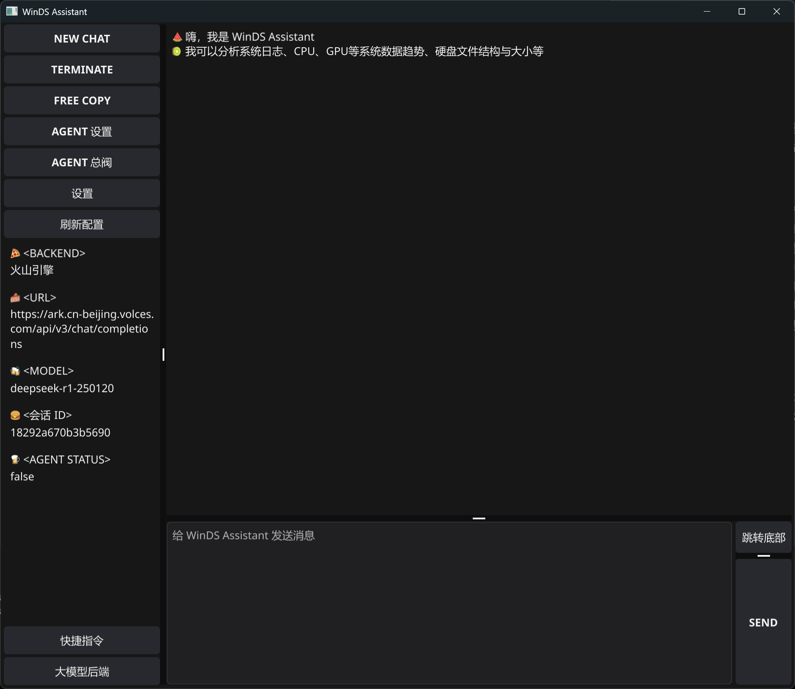

## 🍔 Winds-Assistant
- Windows 上深度集成的 LLM 助手
- 基于 100% Golang



---

## 🍓 亮点功能
### 1 多后端 LLM 支持
- 支持 HTTP/HTTPS 调用 Ollama、通义千问（大模型服务平台百炼）、火山引擎（火山方舟）
- 方便的代码扩展；方便的模型切换

### 2 多 AGENT 并行
- 与 LLM 服务端无关的 Agent 功能，支持多个 Agent 并行
- 内置系统 Agent：Windows 日志、硬件状态（如CPU利用率趋势）、驱动信息、驱动盘文件树信息检索
- 第三方应用 Agent：Bilibili 个性化视频推荐、知乎文章推荐
- 调用成功率：对于 >= 14B 参数的模型，Agent 调用成功率接近 100%
- 方便的代码扩展；自定义 Agent 开关

### 3 现代化交互式界面
- UI 基于 Fyne 编写（Golang）
- 支持深色/浅色模式自动切换
- 优化的文本显示组件：动态滑动窗口加载，支持超长文本不卡顿

---
## 🍉 补充说明
### AGENT 交互方式
- 用户文字需求 -> LLM -> 解析需求，构造 Json -> 返回用户客户端，调用工具 -> LLM -> 任务完成
- 若用户没有调用工具的需求，LLM 可以直接返回结果

### 初始配置（程序初次启动）
- 在 `config/llm_settings.yaml` 中配置 LLM 服务端地址、模型、API Key 等信息
- 在 `config/fast_cliboard.yaml` 中配置快捷指令板内容，保存超长 prompt

---

## 🍊 代码扩展
### 1 后端支持 +
- 你可以通过简单地添加代码，实现各大厂 **LLM API** 的接入
- 参考如下代码
```go
// 上层 LLM 服务端支持的代码位于 workers/api_parser_func.go

// 1. 添加解析该后端 API HTTP/HTTPS Response Body 的结构体
type RespMyBackend struct {
    ...
}

// 2. 实现该方法
// content 是解析后的模型文字输出
// 若该后端使用数据流 (stream=true) 传输, done 用来判断是否传输完毕
func ParserMyBackendResp(resp []byte) (content string, done bool) {
    // 处理前缀、判断控制和检查该resp是否为数据流结束标识符
    ...

    // 解析数据流
	var ch RespMyBackend
    if err := json.Unmarshal(resp, &ch); err != nil {
		fmt.Printf("json.Unmarshal error: %+v\n", err)
	}
    ...

    return
}

// 3. 函数注册, 在 ParserFuncRegister 中添加如下内容即可
var ParserFuncRegister = map[string]func([]byte) (string, bool){
	...
	"myBackend": ParserMyBackendResp,
}
```

```yaml
# 4. 修改位于 config/llm_settings.yaml 的配置文件，添加如下内容
backend:
    ...
    myBackend:
        base_url: https://xxx
        api_key: xxx
        model: xxx  # 默认模型，不代表此 API 仅支持该模型
default_backend: xxx  # 默认后端
```

### 2 Agent 功能 +
- 你可以通过简单地添加代码，实现自定义 Agent 功能
- 高度自定义，你甚至可以在 Agent 中调用其他 Agent，实现 Agent 间的联动；或者通过加上跨设备通信代码，实现多设备的 Agent 调用或负载均衡
- 参考如下代码
```go
// 上层 Agent 支持的代码位于 workers/agent_func.go

// 1. 在 tools/ 下添加自定义 Agent 的具体实现
func GetMyAgentStr(...) string {
    ...
}

// 2. 在 workers/agent_func.go 中写好接口函数
func getMyAgent(q map[string]interface{}, ch chan<- string) {
    // 从 q 中获取参数 (断言)
	params, _ := q["xxx"].(...)
	_o := tools.GetMyAgentStr(params)

    // 整理结果
	output := "<get_myagent> 返回结果：" + _o
	ch <- output
}

// 3. 在 workers/agent_func.go 中写好对应 Agent 的 Prompt，使模型返回确定的格式
// 这里的 param 是你应当在 getMyAgent 中断言的参数
const GET_MYAGENT_PROMPT = `
工具 <get_myagent> 使用规则：
1. 如果用户提到了 <xxx> 等类似的需求, 你可以使用 <get_myagent> 工具来获取
...
x. 最后, 只返回如下类似的json内容, 除此之外不要说任何其他内容, 不要有多余的符号如 Markdown 代码块标识符, 无效换行和空白等:
{
	"tools": {
		"get_myagent": {						  
			"param0": 3,
            "param1": "xxx",
            ...
		}
	}
}`

// 4. 在 workers/agent_func.go 中注册接口函数和对应的 Prompt
// ** 注册 Agent 工具函数
var ToolsFuncRegister = map[string]func(map[string]interface{}, chan<- string) {
    ...
	"get_myagent": getMyAgent,
}

// ** 注册 Agent 工具 Prompt，后面的布尔值是设定其是否启用
var ToolsPromptRegister = map[string]interface{}{
    ...
	"GET_MYAGENT": map[string]interface{}{"prompt": GET_MYAGENT_PROMPT, "enable": true},
}
```

## 🥥 多 AGENT PROMPT 举例
- 这里举例同时使用三种 Agent 工具的情况
- 后端配置：火山引擎 - deepseek-r1-250120
```

🍩 <USER> :
使用工具，告诉我当前系统的日志情况、GPU占用率，再使用我的 Bilibili cookie 推荐两个高质量的视频，要求时长大于5分钟，旅游或者美食相关，给出推荐理由，可以获取5轮推荐

🍲 <ASSISTANT> :


{
	"tools": {
		"get_win_event": {
			"logName": "System",
			"startTime": 1,
			"maxEvents": 50
		},
		"get_sys_health": {
			"minutes": 1
		},
		"get_bili_rcmd": {
			"enable_cookie": true,
			"rounds": 5
		}
	}
}

### 系统日志及硬件状态分析：

---

#### **一、系统日志概况（最近1天 Application 日志）**
1. **关键事件摘要**：
   - **安全启动失败**：系统尝试更新安全启动变量时失败（未启用安全启动功能）。
   - **Windows Defender 更新**：成功安装安全智能更新（版本 1.423.200.0）。
   - **服务配置变动**：`Background Intelligent Transfer Service` 服务多次切换启动类型（可能与系统更新相关）。
   - **DCOM 权限警告**：多个应用程序容器权限配置问题（需检查特定CLSID配置）。
   - **TPM 模块异常**：受信任平台模块（TPM）多次无法执行命令（可能与硬件驱动相关）。

2. **建议**：
   - 检查BIOS中安全启动（Secure Boot）设置是否启用。
   - 更新TPM驱动或联系硬件厂商排查TPM模块状态。

---

#### **二、系统实时健康状态**
1. **CPU**：
   - **当前占用率**：34.9%（i5-12490F），波动范围14%-19%（近5分钟趋势）。
   - **峰值**：瞬时达到50%，整体负载正常。

2. **GPU（RTX 3060 Ti）**：
   - **占用率**：50%（当前），近5分钟波动9%-38%。
   - **温度**：45°C，核心频率210-390 MHz，功耗20W左右。
   - **显存**：2.6GB/8GB（使用率31.7%），无过载风险。

3. **内存与存储**：
   - **内存**：37%已用（12.9GB/32GB），可用充足。
   - **C盘空间**：75.87%已用（103.5GB/136.4GB），建议清理冗余文件。

---

### B站个性化视频推荐（旅行/美食类，时长>5分钟）

---

#### **精选推荐**
1. **《重庆米线挑战！吃两斤奖金888元再送90包米线》**  
   - **BV号**：[BV1YYPpeWETf](https://www.bilibili.com/video/BV1YYPpeWETf)  
   - **UP主**：橙飞一下（8263502）  
   - **时长**：14分40秒 | **播放量**：96.6万 | **点赞**：4.0万  
   - **推荐理由**：硬核美食挑战，展现重庆辣味文化，弹幕互动热烈（2885条），适合重口味爱好者。

2. **《西安裤带面名不虚传，狠狠干它两斤面！》**  
   - **BV号**：[BV1EsPeebEca](https://www.bilibili.com/video/BV1EsPeebEca)  
   - **UP主**：干饭三健客（8680974）  
   - **时长**：8分41秒 | **播放量**：90.5万 | **点赞**：2.2万  
   - **推荐理由**：地道西安小吃探店，UP主幽默解说+高清特写画面，弹幕749条讨论面食文化。

---

#### **备选推荐**
- **《i人狂喜!韩国一人食烤肉店!自助泡面+和牛五花滋滋爆油》**  
  - BV1dP9cYqEBz | 12分13秒 | 播放99.6万 | 适合喜欢韩式烤肉与孤独美食家的用户。

---

### 总结
系统日志需关注安全启动与TPM模块状态，硬件资源整体正常。B站推荐已按您偏好筛选高互动、长时长的优质内容，可点击链接直接观看！
<对话结束>

```
